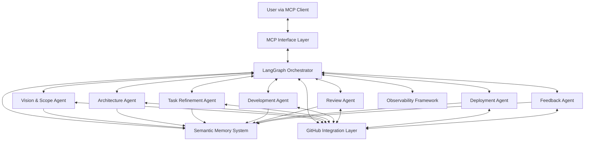
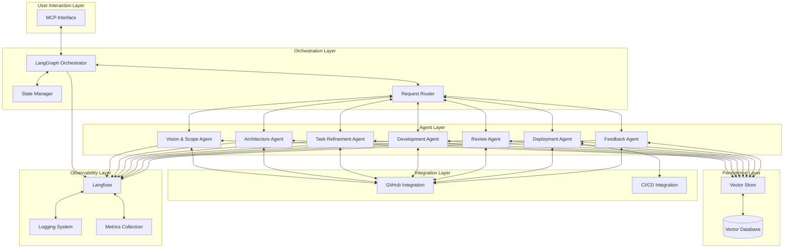

# Clariad AI Agent Ecosystem: Architecture

## Overview & Context

The Clariad AI Agent Ecosystem is designed to create an intelligent, AI-driven workflow assistant that seamlessly integrates into software development processes. The system orchestrates specialized AI agents to guide a software project through all stages of development, ensuring clarity, precision, and accelerated productivity.

This architecture document describes the high-level technical design of the Clariad system, focusing on the key components, their interactions, and the critical decisions that shape the overall structure. The design prioritizes modularity, extensibility, and adherence to software engineering best practices.

## Architectural Constraints

Based on the Vision & Scope document and project requirements, the architecture must adhere to the following constraints:

1. **LLM Integration**: The system must leverage large language models for agent intelligence, working within their capabilities and limitations.
2. **GitHub Centricity**: All artifacts must be stored in GitHub repositories, with documentation in Markdown format.
3. **MCP Compatibility**: The system must interface with users through the Model-Client Protocol (MCP), supporting clients like Claude Desktop and OpenWebUI.
4. **Non-execution Environment**: Clariad doesn't execute code directly but integrates with existing CI/CD systems.
5. **Observability Requirements**: All agent actions must be traceable and monitored through Langfuse.
6. **Separation of Concerns**: Each agent must have a clearly defined responsibility aligned with a specific development phase.
7. **Platform Independence**: The core system must be language-agnostic, adaptable to different programming languages and frameworks.

## System Components & Responsibilities

The Clariad ecosystem consists of the following major components:

### 1. MCP Interface Layer

**Responsibility**: Provides the user-facing conversational interface to the Clariad system.

- Acts as the communication gateway between users and the agent ecosystem
- Translates user input into appropriate commands for the orchestrator
- Handles streaming of agent responses back to the client
- Formats tool usage and other special operations for MCP clients

### 2. LangGraph Orchestrator

**Responsibility**: Coordinates the workflow between agents and manages the system's state.

- Implements the directed graph of agent nodes and their transitions
- Maintains shared state and memory context for inter-agent communication
- Handles conditional logic, branching, and looping for complex workflows
- Routes requests to appropriate agents based on conversation context
- Manages execution mode (autonomous vs. conversational)

### 3. Specialized Agent Nodes

Each agent is an independent module with specific responsibilities:

**Vision & Scope Agent**:
- Establishes project requirements and clear goals
- Creates comprehensive Vision & Scope documents
- Identifies stakeholders, constraints, and success metrics

**Architecture Agent**:
- Designs system architecture and documents key decisions
- Creates Architecture Decision Records (ADRs)
- Validates technical approach against requirements

**Task Refinement Agent**:
- Breaks down work into well-defined user stories with BDD scenarios
- Ensures stories meet INVEST criteria and Definition of Ready
- Prioritizes and organizes the backlog

**Development Agent**:
- Implements code using TDD principles
- Generates tests first, followed by implementation
- Ensures code quality and documentation

**Review Agent**:
- Analyzes code changes for quality and correctness
- Verifies acceptance criteria fulfillment
- Ensures adherence to Definition of Done

**Deployment Agent**:
- Manages CI/CD pipeline configuration
- Ensures deployment readiness
- Handles versioning and release management

**Feedback Agent**:
- Analyzes results and provides retrospective analysis
- Detects architecture drift and technical debt
- Suggests improvements for future iterations

### 4. Semantic Memory System

**Responsibility**: Provides persistent storage and retrieval of project knowledge.

- Stores agent outputs as embeddings in a vector database
- Enables contextual retrieval of project information
- Supports semantic search for relevant artifacts
- Maintains project history and decision context

### 5. GitHub Integration Layer

**Responsibility**: Handles all interactions with GitHub repositories.

- Manages documentation creation and updates
- Handles code commits, pull requests, and reviews
- Creates and manages issues for tasks and feedback
- Provides repository state information to agents

### 6. Observability Framework

**Responsibility**: Monitors system performance and traces agent actions.

- Integrates with Langfuse for comprehensive tracing
- Logs agent prompt/response cycles and decisions
- Captures metrics for system performance analysis
- Provides dashboards for monitoring and debugging

## Data Flow & Component Interactions

The following diagram illustrates the high-level data flow through the Clariad system:

### Workflow Sequence

1. **User Input**: A user interacts with the system through an MCP-compatible client.
2. **Request Routing**: The MCP Interface translates the request and forwards it to the Orchestrator.
3. **Agent Selection**: The Orchestrator determines which agent(s) should process the request.
4. **Context Gathering**: The selected agent retrieves relevant information from Semantic Memory and/or GitHub.
5. **Processing**: The agent performs its specialized function (design, coding, review, etc.).
6. **Artifact Creation**: The agent generates outputs and stores them in GitHub and Semantic Memory.
7. **Response**: Results are returned to the user through the MCP Interface.
8. **Observability**: All steps are logged and traced through the Observability Framework.

## Technology Stack Choices

The following technology choices form the foundation of the Clariad architecture:

### Core Technologies

| Component | Technology Choice | Rationale |
|-----------|-------------------|-----------|
| Agent Framework | LangGraph + LangChain | Provides robust agent orchestration, state management, and integration capabilities |
| Semantic Memory | PostgreSQL + pgvector | Industry-standard database with vector search capabilities |
| Observability | Langfuse | Specialized for LLM application tracing and monitoring |
| Version Control | GitHub | Required by specifications, industry standard |
| Documentation | Markdown | Required by specifications, readable and widely supported |
| MCP Server | Custom implementation | Necessary for MCP protocol compatibility |

### Infrastructure Considerations

While specific deployment infrastructure is out of scope, the architecture supports deployment as:

- A containerized application (Docker)
- A serverless function set (AWS Lambda, Google Cloud Functions)
- A traditional web service (FastAPI, Flask, etc.)

## Integration Points

The Clariad ecosystem interfaces with external systems at several key points:

### 1. MCP Client Integration

- **Protocol**: Model-Client Protocol (MCP)
- **Clients**: Claude Desktop, OpenWebUI
- **Capabilities**: Streaming responses, tool usage, multi-turn dialogue

### 2. GitHub Integration

- **API Access**: GitHub API v4 (GraphQL) and v3 (REST)
- **Permissions Required**:
  - Repository contents (read/write)
  - Issues (read/write)
  - Pull requests (read/write)
  - Workflow (read/write) for CI/CD configuration

### 3. LLM Provider Integration

- **API Access**: Anthropic Claude API, potentially other providers
- **Capabilities**: Context window handling, function calling, structured output

### 4. CI/CD System Integration

- **Systems**: GitHub Actions (primary), potentially others
- **Integration Type**: Configuration file generation, status monitoring

## Risks & Mitigations

| Risk | Description | Mitigation |
|------|-------------|------------|
| LLM Limitations | Model hallucinations or knowledge cutoff issues | Implement validation checks, fact-grounding, and human feedback loops |
| GitHub API Rate Limits | Potential throttling with high activity | Implement rate limiting, request batching, and API usage optimization |
| Security Boundaries | Agents need appropriate permissions | Use principle of least privilege, validate operations before execution |
| Maintainability Complexity | Multiple agents may be difficult to maintain | Strong modularity, comprehensive documentation, shared utilities |
| User Experience Consistency | Multiple agents might lead to inconsistent UX | Single MCP interface layer, standardized response formats |
| Cost Management | LLM API usage costs could escalate | Optimize prompt design, cache results, implement usage monitoring |

## Architecture Mapping to Requirements

The table below maps key features from the Vision & Scope document to the architectural components that implement them:

| Requirement | Architectural Component |
|-------------|-------------------------|
| Comprehensive Multi-Agent Ecosystem | Specialized Agent Nodes, LangGraph Orchestrator |
| GitHub Integration | GitHub Integration Layer |
| LangGraph Orchestration | LangGraph Orchestrator, Shared State & Memory |
| MCP Protocol Support | MCP Interface Layer |
| Software Engineering Best Practices | Built into agent prompt designs and workflows |
| Observability & Traceability | Observability Framework, Langfuse integration |
| Extensible Infrastructure | Modular design, Semantic Memory System |

## Definition of Done for Architecture

This architecture design is considered "Done" when:

- ✅ All major components are identified and their responsibilities defined
- ✅ Component interactions and data flows are clearly documented
- ✅ Key architectural decisions are documented with ADRs
- ✅ Technical constraints are addressed
- ✅ Requirements from Vision & Scope are mapped to architectural components
- ✅ Risks and mitigations are identified
- ✅ Technology choices are justified

## Reference Architecture Diagram

The following diagram illustrates a more detailed view of the Clariad system architecture:

---

**Document Status**: Approved  
**Last Updated**: May 17, 2025  
**Created By**: Architecture Agent  
**Version**: 1.0

See the [architecture/](./architecture/) directory for detailed Architecture Decision Records (ADRs).