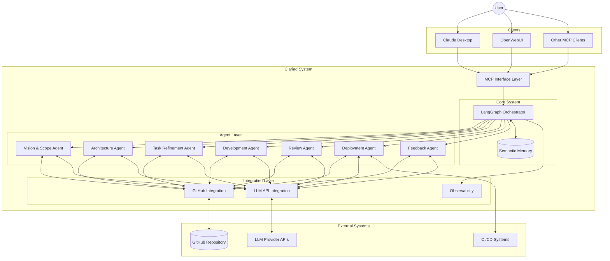
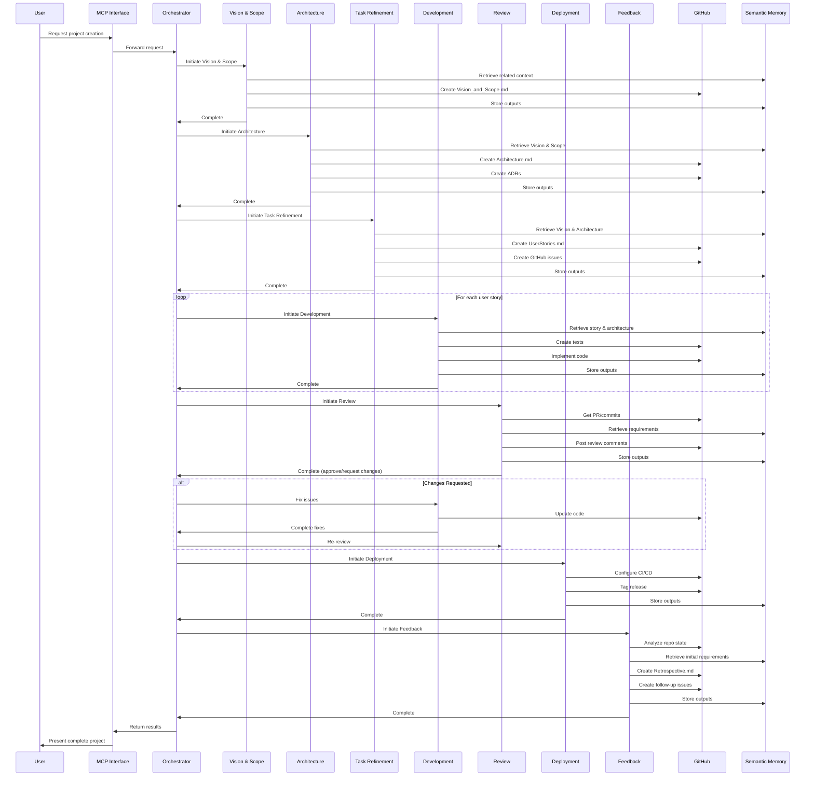
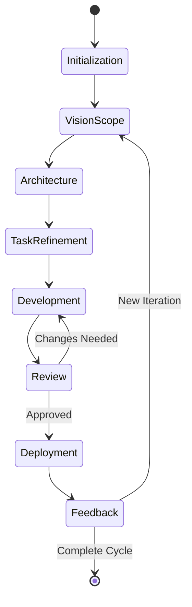
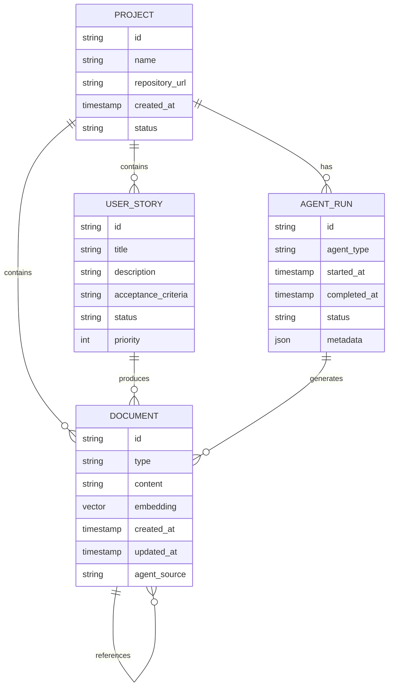

# Clariad System Architecture Diagrams

This document contains the high-level architectural diagrams for the Clariad AI Agent Ecosystem.

## System Component Overview

The following diagram illustrates the major components of the Clariad system and their relationships:

## Agent Workflow Sequence

The following diagram illustrates the workflow sequence for the Clariad agent system:

## LangGraph State Machine

The following diagram illustrates the LangGraph state machine for the Clariad system:

## Data Model

The following diagram illustrates the simplified semantic memory data model:

