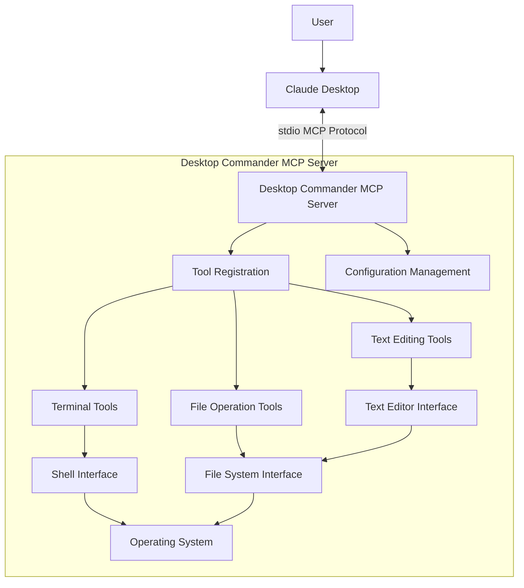

# Desktop Commander MCP: Technical Reference

This document provides a technical breakdown of how Desktop Commander MCP interacts with Claude Desktop, serving as a reference implementation for Clariad's MCP integration approach.

## Overview

Desktop Commander MCP is an open-source MCP server that enables Claude Desktop to execute terminal commands, manage processes, and perform file system operations. It's built on top of the MCP Filesystem Server to provide additional search and file editing capabilities.

## Architecture and Communication Flow



## Communication Protocol

### 1. Standard Input/Output (stdio)

Desktop Commander communicates with Claude Desktop through standard input/output (stdio), following the MCP protocol specification:

- **Input**: Desktop Commander receives tool invocation requests from Claude Desktop as JSON-RPC 2.0 messages via stdin
- **Output**: Desktop Commander sends results back to Claude Desktop via stdout
- **Transport Layer**: The stdio mechanism is established when Claude Desktop launches the MCP server as specified in the claude_desktop_config.json file

### 2. MCP Protocol Message Format

Desktop Commander implements the MCP protocol with JSON-RPC 2.0 as the message format:

```json
// Example request from Claude Desktop to Desktop Commander
{
  "jsonrpc": "2.0",
  "id": "request-123",
  "method": "invoke_tool",
  "params": {
    "name": "execute_command",
    "parameters": {
      "command": "ls -la",
      "timeout_ms": 5000
    }
  }
}

// Example response from Desktop Commander to Claude Desktop
{
  "jsonrpc": "2.0",
  "id": "request-123",
  "result": {
    "output": "total 32\ndrwxr-xr-x  5 user  staff   160 May 17 14:22 .\ndrwxr-xr-x  3 user  staff    96 May 17 14:20 ..\n-rw-r--r--  1 user  staff  1024 May 17 14:22 file.txt\n"
  }
}
```

## Tool Registration Process

Desktop Commander registers its capabilities with Claude Desktop through the MCP protocol's `list_tools` method. This allows Claude to know what tools are available and how to invoke them.

### Tool Registration Flow

1. Claude Desktop launches Desktop Commander as defined in the claude_desktop_config.json file
2. Claude Desktop sends a `list_tools` request to Desktop Commander via stdio
3. Desktop Commander responds with a list of available tools, their descriptions, and parameter schemas
4. Claude Desktop now knows what tools it can invoke and presents them to the user as needed

```json
// Example tool registration response
{
  "jsonrpc": "2.0",
  "id": "list-tools-123",
  "result": {
    "tools": [
      {
        "name": "execute_command",
        "description": "Execute a terminal command with timeout",
        "parameters": {
          "type": "object",
          "properties": {
            "command": {"type": "string"},
            "timeout_ms": {"type": "number"},
            "shell": {"type": "string"}
          },
          "required": ["command"]
        }
      },
      // Other tools...
    ]
  }
}
```

## Key Implementation Details

### 1. Configuration Integration

Desktop Commander is configured in the Claude Desktop app's config file:

```json
// Example claude_desktop_config.json
{
  "mcpServers": {
    "desktop-commander": {
      "command": "npx",
      "args": [
        "-y",
        "@wonderwhy-er/desktop-commander"
      ]
    }
  }
}
```

This configuration tells Claude Desktop:
- How to launch the Desktop Commander MCP server (`npx -y @wonderwhy-er/desktop-commander`)
- What to call the server in the UI ("desktop-commander")

### 2. Server Initialization Process

When Claude Desktop starts, it follows this process to initialize Desktop Commander:

1. Claude Desktop reads the configuration file to identify registered MCP servers
2. It launches Desktop Commander using the specified command and arguments
3. It establishes stdio pipes for communication with the server
4. It sends an initial handshake to verify the server is ready
5. It requests the list of available tools from the server

### 3. Tool Invocation Flow

When Claude determines it needs to use a Desktop Commander tool:

1. Claude analyzes the user's request and decides a specific tool is needed (e.g., `execute_command`)
2. Claude Desktop shows a permission dialog to the user, asking for approval to use the tool
3. If approved, Claude Desktop sends an `invoke_tool` request to Desktop Commander via stdio
4. Desktop Commander processes the request and performs the action (e.g., executing a terminal command)
5. Desktop Commander streams output or returns the final result via stdio
6. Claude Desktop receives the result and incorporates it into Claude's response

### 4. Error Handling

Desktop Commander implements robust error handling to maintain a stable connection:

- **Timeouts**: Commands that exceed their timeout are terminated and return partial results
- **Permission Errors**: File access or command execution permissions are checked before execution
- **Malformed Requests**: Invalid requests receive error responses with descriptive messages
- **Process Management**: Background processes are tracked and can be terminated if needed

## Security Considerations

Desktop Commander implements several security features:

1. **Allowed Directories**: File operations can be restricted to specific directories
2. **Blocked Commands**: Specific shell commands can be blocked for security reasons
3. **Permission Dialogs**: Claude Desktop shows permission dialogs before executing tools
4. **Configuration Separation**: Configuration should be managed in separate chats from file operations

## Lessons for Clariad Implementation

Key insights from Desktop Commander that apply to Clariad:

1. **Use stdio for Communication**: Implement the MCP protocol using stdio for reliable communication with Claude Desktop
2. **Clear Tool Definitions**: Define each specialized agent as a tool with clear parameters and descriptions
3. **Structured Error Handling**: Implement robust error handling for each tool operation
4. **Configuration Management**: Provide configuration options that can be adjusted by users
5. **Security First**: Implement appropriate security measures for file access and command execution
6. **Leverage Existing Claude Connection**: Desktop Commander doesn't establish its own LLM connection, but leverages the existing Claude Desktop connection

## Code Architecture Patterns

Desktop Commander follows these architectural patterns:

1. **Command Pattern**: Each tool is implemented as a command with execute, validate, and result formatting methods
2. **Transport Abstraction**: The stdio transport is abstracted to allow for future transport methods
3. **Configuration Registry**: A central configuration registry manages server settings
4. **Tool Registry**: A central registry of available tools handles discovery and invocation
5. **Stream Processing**: Output from long-running commands is processed as streams for immediate feedback

## Conclusion

Desktop Commander MCP serves as an excellent reference implementation for Clariad's integration with Claude Desktop. By following the same communication patterns and architectural principles, Clariad can achieve a seamless integration that leverages Claude Desktop's existing LLM capabilities without establishing separate connections.

---

*Document Status: Reference*  
*Last Updated: May 17, 2025*  
*Author: Clariad Team*